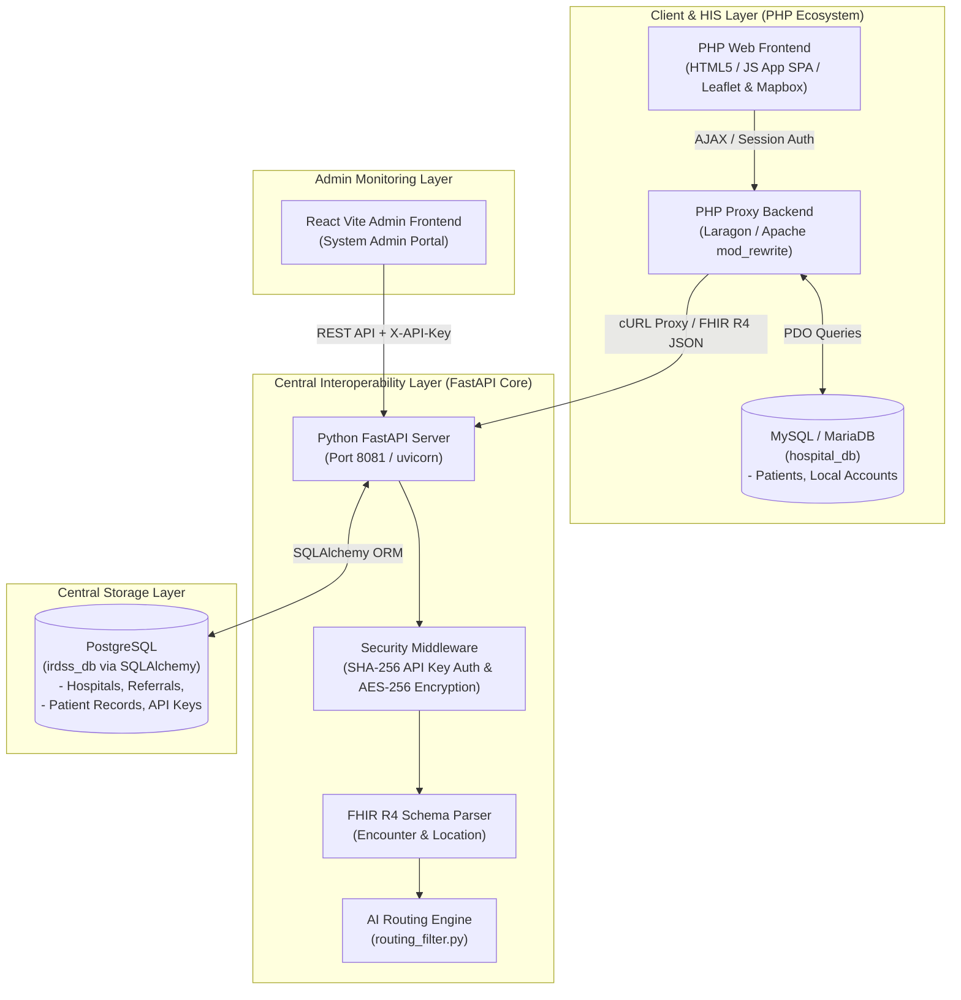
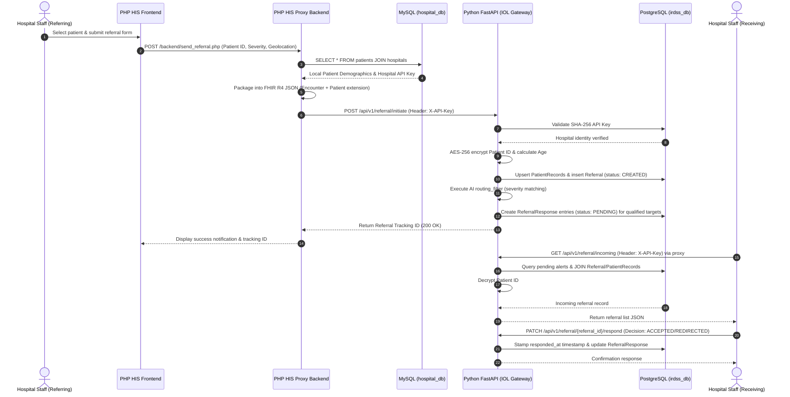

# IRDSS System Architecture & Data Flow Overview

This document provides a comprehensive structural analysis and technical breakdown of the **Intelligent Referral Decision Support System (IRDSS)** and its companion **Mock Hospitals HIS** suite.

---

## 1. System High-Level Architecture Diagram

The system follows a multi-tenant, distributed architecture where individual Hospital Information Systems (HIS) interact with a central Interoperability Layer (IOL) API Gateway.

---

## 2. System Subsystems Breakdown

### A. Hospital Information System (HIS) / Mock Hospitals (`mock_hospitals`)
* **Technology Stack**: PHP 8.x, Vanilla JS / jQuery SPA, MySQL (`hospital_db`), Apache (`.htaccess`).
* **Role**: Simulates local hospital EMR/HIS nodes (e.g., St. Jude General Hospital, City Care Medical Center, Metro Health Medical Center).
* **Key Components**:
  * [index.html](file:///c:/laragon/www/mock_hospitals/frontend/index.html) & [app.js](file:///c:/laragon/www/mock_hospitals/frontend/js/app.js): Single-page interface for patient selection, referral dispatch, incoming referral notifications, and capacity management.
  * [config.php](file:///c:/laragon/www/mock_hospitals/backend/config.php): Database connection management and session handling. Defines `IOL_ENDPOINT_URL` (`http://localhost:8081/api/v1/referral/initiate`).
  * [send_referral.php](file:///c:/laragon/www/mock_hospitals/backend/send_referral.php): Fetches local patient demographics from MySQL, builds standard FHIR R4 JSON payloads (`Encounter` + `Patient`), attaches `X-API-Key`, and posts to central IOL.
  * [referral_api.php](file:///c:/laragon/www/mock_hospitals/backend/referral_api.php) & [inventory_api.php](file:///c:/laragon/www/mock_hospitals/backend/inventory_api.php): Transparent reverse proxies using cURL to query FastAPI endpoints (`/api/v1/referral/*` and `/api/v1/hospitals/*`).
  * [.htaccess](file:///c:/laragon/www/mock_hospitals/.htaccess): Rewrite rules routing API path patterns seamlessly to PHP proxy backend endpoints.

### B. Interoperability Layer (IOL) Backend (`irdss_project/app`)
* **Technology Stack**: Python 3.11+, FastAPI, SQLAlchemy, Alembic, PostgreSQL (`irdss_db`), PyCryptodome (AES-256).
* **Role**: Central decision support and data exchange hub connecting regional hospitals across Mindanao.
* **Key Components**:
  * [main.py](file:///c:/IRDSS/irdss_project/app/main.py): Entry point for FastAPI application with CORS middleware configuration.
  * [referral.py](file:///c:/IRDSS/irdss_project/app/routers/referral.py): Core referral workflow engine:
    * `POST /api/v1/referral/initiate`: Validates FHIR payload, encrypts patient FHIR ID with AES-256, upserts patient records, creates a `Referral` entry, and broadcasts alerts (`ReferralResponse` with status `PENDING`) to qualified target facilities.
    * `GET /api/v1/referral/incoming`: Returns pending incoming referral requests for the authenticated hospital, dynamically decrypting patient IDs.
    * `PATCH /api/v1/referral/{referral_id}/respond`: Updates hospital decision (`ACCEPTED` / `REDIRECTED`) with audited turnaround timestamps (`seen_at`, `responded_at`).
    * `GET /api/v1/referral/{referral_id}/recommendations`: Returns matching hospitals sorted by available capacity.
  * [hospitals.py](file:///c:/IRDSS/irdss_project/app/routers/hospitals.py): Handles hospital resource registration (FHIR R4 Location schema) and inventory metrics updates (available beds, equipment, specialist count).
  * [routing_filter.py](file:///c:/IRDSS/irdss_project/app/ai/routing_filter.py): Rule-based decision algorithm targeting candidate receiving facilities based on disease severity.
  * [db_connection.py](file:///c:/IRDSS/irdss_project/app/database/db_connection.py): SQLAlchemy engine and session management connected to PostgreSQL.

### C. Admin Frontend (`irdss_project/admin_frontend`)
* **Technology Stack**: React 18, Vite, ES6+.
* **Role**: Central administrator portal for monitoring regional referral statistics, hospital node health, and API key management.

---

## 3. End-to-End Referral Data Flow

The following sequence diagram outlines how data moves between components during a patient referral lifecycle:

---

## 4. Key Security & Interoperability Standards

1. **FHIR R4 Schema Standard**: Clinical data transmitted across system boundaries strictly conforms to the HL7 FHIR R4 specification using JSON resources (`Encounter` and `Patient`).
2. **Data Privacy Act / HIPAA Compliance**: Patient identification details are encrypted at rest in the central PostgreSQL database using **AES-256 encryption** (`aes_encrypt` / `aes_decrypt`).
3. **Multi-Tenant API Authentication**: External HIS nodes authenticate to the Interoperability Layer using `X-API-Key` headers. The central server verifies incoming keys against SHA-256 hashes stored in PostgreSQL `api_keys`.
4. **CORS & Proxying**: PHP proxy layers resolve cross-origin policies and encapsulate API key management, keeping client-side JavaScript clean and secure.
